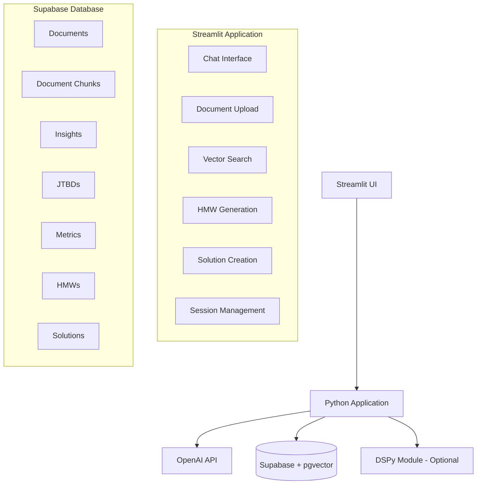

# Design Document

## Overview

The JTBD Assistant Platform is a single Streamlit Python application (app.py) that uses OpenAI for intelligent content generation with optional DSPy enhancement. The system uses Supabase with pgvector for document storage and semantic search, enabling rapid transformation of research artifacts into actionable solutions. The MVP focuses on session isolation, embedding caching, and lightweight LLM trace logging for observability without complexity.

## Architecture

### High-Level Architecture



### Service Communication

- **Streamlit to OpenAI**: Direct API calls for embeddings and generation
- **Streamlit to Supabase**: Direct client connections with service key
- **DSPy Integration**: Optional local module for enhanced generation
- **Fallback Strategy**: OpenAI direct when DSPy unavailable

## Components and Interfaces

### 1. Document Processing Component

**Purpose**: Handle document upload, chunking, embedding, and insight extraction

**Key Functions**:
- `process_document(file, session_id)`: Main processing pipeline
- `generate_embedding(text)`: Cached 1536-dim vectors via OpenAI
- `_cached_embedding(text_hash, model)`: Streamlit cached embedding function
- `extract_insights(chunks, doc_id)`: AI-powered insight extraction using LLM wrapper

**Caching Strategy**:
- Embedding cache with 1-hour TTL to reduce latency and cost
- Cache keyed by text hash for deduplication
- Optional cache bypass toggle for debugging

**Error Handling**:
- File size validation (1MB limit)
- Format validation (.md/.txt only)
- Embedding generation failures with retry logic

### 2. Vector Search Component

**Purpose**: Org-filtered semantic search across document chunks

**Key Functions**:
- `search_documents(query, session_id)`: pgvector similarity search via RPC
- `search_similar_chunks(query_embedding, match_count, similarity_threshold, filter_org_id)`: Org-filtered RPC
- `rank_results(results)`: Score and sort by relevance

**Session Isolation**:
- RPC function joins with documents table to filter by org_id
- Prevents cross-session data leakage in vector search
- Maintains performance with proper indexing

**Performance Considerations**:
- ivfflat indexes for vector operations
- Result limiting (100 max)
- Similarity threshold filtering (≥0.7)

### 3. Chat Interface Component

**Purpose**: Conversational exploration and context building

**Key Functions**:
- `process_chat(message, session_id)`: Route chat messages
- `display_structured_response(data)`: Present results with selection buttons
- `build_context(selections)`: Aggregate user selections in session state
- `main()`: Streamlit UI orchestration

**Context Management**:
- Streamlit session state for context storage
- Token budget enforcement (4000 limit)
- Context truncation strategies

### 4. LLM Wrapper Component

**Purpose**: Centralized LLM calls with trace logging and error handling

**Key Functions**:
- `call_llm(template_key, rendered_prompt, vars, session_id, model)`: Unified LLM interface
- `clamp_text(text, limit)`: Token budget enforcement with truncation
- Automatic trace logging to `llm_traces` table
- Structured error handling with retry logic

**Template Keys**:
- `"insights.extract"`: Document insight extraction
- `"hmw.synthesize"`: HMW generation from context
- `"solutions.ideate"`: Solution creation from HMWs

### 5. HMW Generation Component

**Purpose**: Generate How Might We questions from selected context

**Key Functions**:
- `generate_hmws(context, session_id)`: Uses LLM wrapper with trace logging
- `try_dspy_hmw(context)`: Optional DSPy module integration
- `fallback_hmw_generation(context)`: OpenAI via LLM wrapper
- `persist_hmws(hmws, context)`: Store with relationships

**DSPy Integration**:
- Local module import (offline only)
- Graceful fallback to OpenAI when unavailable
- All calls go through LLM wrapper for consistency

### 6. Solution Creation Component

**Purpose**: Generate prioritized solutions from HMWs

**Key Functions**:
- `generate_solutions(hmw_id, session_id)`: Uses LLM wrapper with trace logging
- `try_dspy_solutions(hmws)`: Optional DSPy module integration
- `intelligent_metric_assignment(solutions)`: Per-session metric fallback
- `score_solutions(solutions)`: Calculate final scores

**Per-Session Metric Fallback**:
- Check for session-specific metrics first
- Create session default metric if none exist
- Avoid global metric contamination across sessions

**Scoring Algorithm**:
- Final Score = (Impact × 0.6) + ((10 - Effort) × 0.4)
- Impact and Effort on 1-10 scale
- Automatic sorting by final score

## Data Models

### Core Entities

```sql
-- Documents with deduplication
documents {
  id: UUID (PK)
  org_id: VARCHAR(50) -- session isolation
  title: VARCHAR(255)
  content: TEXT
  content_hash: VARCHAR(64) UNIQUE -- deduplication
  embedding: vector(1536)
  created_at: TIMESTAMP
}

-- Chunked content for vector search
document_chunks {
  id: UUID (PK)
  document_id: UUID (FK)
  chunk_index: INT
  content: TEXT
  embedding: vector(1536) -- indexed with ivfflat
  start_char: INT
  end_char: INT
}

-- Extracted insights
insights {
  id: UUID (PK)
  org_id: VARCHAR(50)
  description: TEXT
  document_id: UUID (FK)
  confidence_score: FLOAT
  embedding: vector(1536)
  dedupe_hash: VARCHAR(64) UNIQUE
}

-- User-defined JTBDs
jtbds {
  id: UUID (PK)
  org_id: VARCHAR(50)
  statement: TEXT
  context: TEXT
  outcome: TEXT
  embedding: vector(1536)
  dedupe_hash: VARCHAR(64)
}

-- Performance metrics
metrics {
  id: UUID (PK)
  org_id: VARCHAR(50)
  name: VARCHAR(255)
  current_value: NUMERIC(12,2)
  target_value: NUMERIC(12,2)
  unit: VARCHAR(50)
}

-- Generated HMW questions
hmws {
  id: UUID (PK)
  org_id: VARCHAR(50)
  question: TEXT CHECK (question LIKE 'How might we%')
  priority: FLOAT
  dedupe_hash: VARCHAR(64) UNIQUE
}

-- Generated solutions
solutions {
  id: UUID (PK)
  org_id: VARCHAR(50)
  title: VARCHAR(255)
  description: TEXT
  customer_benefit: TEXT
  user_journey: TEXT
  impact_score: INT CHECK (1-10)
  effort_score: INT CHECK (1-10)
  final_score: FLOAT
  dedupe_hash: VARCHAR(64) UNIQUE
}
```

### Relationship Tables

```sql
-- Many-to-many relationships
hmws_jtbds (hmw_id, jtbd_id)
hmws_metrics (hmw_id, metric_id)
hmws_insights (hmw_id, insight_id)
solutions_hmws (solution_id, hmw_id)
solutions_metrics (solution_id, metric_id)
```

### Session Isolation and Deduplication

- All entities include `org_id` field with `demo_xxxxx` format
- Org-scoped deduplication prevents cross-session collisions
- Vector search RPC includes org filtering for proper isolation
- 24-hour auto-cleanup via scheduled function
- Per-session metric fallback instead of global default

### LLM Observability

```sql
-- Lightweight trace table for prompt/response logging
llm_traces {
  id: UUID (PK)
  session_id: TEXT
  template_key: TEXT -- e.g., "insights.extract", "hmw.synthesize"
  model: TEXT
  rendered_prompt: TEXT
  input_vars: JSONB
  response: TEXT
  tokens_prompt: INT
  tokens_completion: INT
  latency_ms: INT
  error: TEXT
  created_at: TIMESTAMPTZ
}
```

## Error Handling

### Error Response Format

```python
# Error response structure
{
    "code": "UPPER_SNAKE_CASE",      # Error code
    "message": "Human readable",      # Error message
    "action": "RETRY|FALLBACK|NONE",  # Recommended action
    "retry_after_ms": 3000           # Retry delay
}
```

### Error Categories

**File Processing Errors**:
- `FILE_TOO_LARGE`: >1MB files rejected
- `INVALID_FORMAT`: Non-.md/.txt files rejected
- `EMBEDDING_FAILED`: OpenAI API failures with retry

**Service Communication Errors**:
- `DSPY_MODULE_ERROR`: DSPy module unavailable, use OpenAI fallback
- `OPENAI_API_ERROR`: OpenAI API failures with retry
- `AUTH_FAILED`: Invalid API key

**Database Errors**:
- `VECTOR_SEARCH_TIMEOUT`: pgvector query timeout
- `CONSTRAINT_VIOLATION`: Data validation failures
- `CONNECTION_ERROR`: Supabase connectivity issues

### Fallback Strategies

1. **DSPy Unavailable**: Use OpenAI direct via LLM wrapper with trace logging
2. **No Metrics Found**: Create per-session default metric instead of global
3. **Vector Search Fails**: Fall back to text-based search with org filtering
4. **Token Limit Exceeded**: Use `clamp_text()` utility for consistent truncation
5. **Embedding Cache Miss**: Generate fresh embedding with automatic caching

## Testing Strategy

### Unit Testing

**Python Components**:
- Document processing pipeline
- Vector search functionality
- Chat message routing
- Context management
- Error handling scenarios

**DSPy Module**:
- HMW generation logic
- Solution creation algorithms
- Metric assignment intelligence
- Fallback behavior validation

### Integration Testing

**External Services**:
- OpenAI API calls and error handling
- Supabase client connections and queries
- DSPy module integration and fallbacks
- Vector search performance

**Database Operations**:
- Supabase client connections
- Vector search performance
- Relationship integrity
- Session isolation

### End-to-End Testing

**User Workflows**:
1. Document upload → insight extraction → chat exploration
2. Context building → HMW generation → solution creation
3. Error scenarios → fallback behavior → recovery

**Performance Testing**:
- Document processing under load
- Vector search response times
- Concurrent session handling
- Memory usage patterns

### Demo Safety Testing

**Session Isolation**:
- Cross-session data leakage prevention
- Auto-cleanup verification
- Session timeout handling

**Data Validation**:
- File size enforcement
- Format validation
- Token budget compliance
- Relationship constraint validation

## Security Considerations

### Authentication
- Supabase service key for database access
- OpenAI API key for embeddings and generation
- Environment-based key configuration via Streamlit secrets
- No user authentication required for demo

### Data Protection
- Session-based isolation prevents data mixing
- 24-hour auto-deletion for demo data
- TLS 1.3 for all communications
- No persistent PII storage

### Input Validation
- File size and format validation
- SQL injection prevention via parameterized queries
- Token budget enforcement
- Content sanitization for embeddings

## Performance Optimization

### Vector Search
- ivfflat indexes on embedding columns
- Org-filtered RPC for session isolation
- Similarity threshold filtering (≥0.7)
- Result limiting (100 max)
- Index maintenance strategies

### Caching Strategy
- Streamlit cached embedding generation with 1-hour TTL
- Cache keyed by text hash for deduplication
- Session context in Streamlit session state
- Database connection pooling via Supabase client
- Optional cache bypass toggle for debugging

### Resource Management
- Token budget enforcement via `clamp_text()` utility
- LLM trace logging for observability
- Per-session metric fallback
- 24-hour demo data cleanup
- Memory-efficient session state management