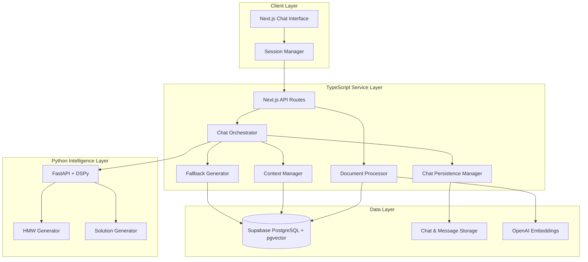

# Design Document

## Overview

The JTBD Assistant Platform is a dual-service architecture combining TypeScript orchestration (Next.js + AI SDK) with Python intelligence (FastAPI + DSPy) to transform customer research into actionable solutions. The system uses Supabase with pgvector for document storage, embedding search, and relationship management.

### Key Design Principles

- **Separation of Concerns**: TypeScript handles orchestration, streaming, and persistence; Python provides specialized AI intelligence
- **Graceful Degradation**: Local fallbacks ensure functionality when DSPy services are unavailable
- **Streaming UX**: Real-time chat interface with server-sent events for responsive user experience
- **Context Building**: Progressive selection of insights, metrics, and JTBDs to build context for solution generation

## Architecture

### High-Level Architecture



### Service Communication

- **Client ↔ TypeScript**: HTTP/SSE for streaming chat responses
- **TypeScript ↔ Python**: HTTP with static API key authentication
- **Services ↔ Supabase**: PostgreSQL connections with RPC for vector search
- **Services ↔ OpenAI**: API calls for embeddings and chat completions

## Components and Interfaces

### TypeScript Components

#### Chat Orchestrator
**Purpose**: Manages conversation flow, intent detection, and response streaming

**Key Methods**:
- `handleChatMessage(messages, sessionId)`: Main chat handler with streaming response
- `detectIntent(message)`: Simple keyword-based intent detection
- `retrieveContext(query, type)`: Vector search for relevant content
- `streamResponse(content, context)`: Server-sent event streaming

**Intent Detection Logic**:
```typescript
function detectIntent(message: string): ChatIntent {
  const lowerMessage = message.toLowerCase();
  
  if (lowerMessage.includes('insight') || lowerMessage.includes('what did we learn')) {
    return 'retrieve_insights';
  }
  if (lowerMessage.includes('metric') || lowerMessage.includes('measure')) {
    return 'retrieve_metrics';
  }
  if (lowerMessage.includes('jtbd') || lowerMessage.includes('job to be done')) {
    return 'retrieve_jtbds';
  }
  if (lowerMessage.includes('hmw') || lowerMessage.includes('how might we')) {
    return 'generate_hmw';
  }
  if (lowerMessage.includes('solution') || lowerMessage.includes('solve')) {
    return 'create_solutions';
  }
  
  return 'general_exploration';
}
```

#### Document Processor
**Purpose**: Handles file uploads, chunking, embedding, and insight extraction

**Key Methods**:
- `processUpload(file)`: Validates format, chunks content, generates embeddings
- `extractInsights(chunks)`: Automatically generates insights from document content
- `storeDocumentData(document, chunks, insights)`: Persists all document-related data

**Processing Pipeline**:
1. Validate file format (.md, .txt only)
2. Extract and clean text content
3. Chunk content (500-1000 tokens per chunk with overlap)
4. Generate embeddings for chunks
5. Extract insights using AI analysis
6. Store document, chunks, and insights with relationships

#### Chat Persistence Manager
**Purpose**: Manages chat session lifecycle, message persistence, and context tracking

**Key Methods**:
- `createChatSession(userId, title?, initialContext?)`: Creates new chat with optional initial context
- `loadChatSession(chatId)`: Retrieves chat with messages and context
- `saveMessage(chatId, message, metadata)`: Persists message with processing metadata
- `updateChatContext(chatId, contextUpdates)`: Updates selected documents/insights/JTBDs/metrics
- `archiveChat(chatId)`: Soft-delete chat session
- `getChatHistory(userId, limit, offset)`: Retrieves user's chat sessions

#### Context Manager
**Purpose**: Manages the context window and state for ongoing conversations

**Key Methods**:
- `buildChatContext(chatId)`: Constructs context from selected items
- `updateSelectedItems(chatId, type, ids)`: Updates selected context items
- `getEffectiveContext(messages, maxTokens)`: Manages token budget with truncation
- `trackContextUsage(messageId, contextItems)`: Records what context was used

#### Fallback Generator
**Purpose**: Provides local generation when DSPy services are unavailable

**Key Methods**:
- `generateHMWsFallback(context)`: Local HMW generation using OpenAI
- `generateSolutionsFallback(hmws, context)`: Local solution generation
- `selectFallbackMetric()`: Returns seeded default metric ID

### Python Components

#### DSPy HMW Generator
**Purpose**: Generates optimized "How Might We" questions using DSPy

**DSPy Signature**:
```python
class GenerateHMW(dspy.Signature):
    """Generate How Might We questions from context"""
    jtbds = dspy.InputField(desc="Jobs to be done statements")
    metrics = dspy.InputField(desc="Relevant metrics and targets")
    insights = dspy.InputField(desc="Research insights")
    user_prompt = dspy.InputField(desc="User's specific request")
    
    hmws = dspy.OutputField(desc="List of How Might We questions starting with 'How might we'")
    reasoning = dspy.OutputField(desc="Explanation of question generation")
```

#### DSPy Solution Generator
**Purpose**: Creates prioritized solutions with intelligent metric assignment

**DSPy Signature**:
```python
class CreateSolutions(dspy.Signature):
    """Generate solutions for How Might We questions"""
    hmws = dspy.InputField(desc="Selected How Might We questions")
    available_metrics = dspy.InputField(desc="Available metrics for assignment")
    context = dspy.InputField(desc="Additional context from insights and JTBDs")
    
    solutions = dspy.OutputField(desc="List of solutions with scores and metric assignments")
    metric_selection_reasoning = dspy.OutputField(desc="Why specific metrics were chosen")
```

### API Interfaces

#### TypeScript Public APIs

```typescript
// Enhanced chat endpoint with session management
POST /api/v1/chat
Request: { 
  chat_id?: string,  // Optional: continue existing chat
  messages?: Message[], // Optional: override stored messages
  context_override?: {  // Optional: override stored context
    document_ids?: string[],
    insight_ids?: string[],
    jtbd_ids?: string[],
    metric_ids?: string[]
  }
}
Response: Server-Sent Events stream with:
  - message chunks
  - intent detection
  - context updates
  - processing metadata

// Chat management endpoints
GET /api/v1/chats
Response: { chats: Chat[], total: number }

GET /api/v1/chats/:id
Response: { chat: Chat, messages: Message[] }

PUT /api/v1/chats/:id/context
Request: { 
  document_ids?: string[],
  insight_ids?: string[],
  jtbd_ids?: string[],
  metric_ids?: string[]
}
Response: { updated: boolean }

DELETE /api/v1/chats/:id
Response: { archived: boolean }

// Document upload
POST /api/v1/upload
Request: multipart/form-data with file
Response: { document_id: string, chunks_created: number, insights_generated: number }

// JTBD creation
POST /api/v1/jtbds
Request: { statement: string, context?: string, outcome?: string }
Response: { id: string, embedding_generated: boolean }

// Metric creation
POST /api/v1/metrics
Request: { name: string, current_value: number, target_value: number, unit?: string }
Response: { id: string }
```

#### Python Intelligence APIs

```python
# HMW Generation
POST /api/intelligence/generate_hmw
Request: {
    jtbds?: JTBD[],
    metrics?: Metric[],
    insights?: Insight[],
    user_prompt?: string,
    count?: number
}
Response: {
    hmws: [{ question: string, score?: number, source_refs?: string[] }],
    meta: { duration_ms: number, retries: number }
}

# Solution Creation
POST /api/intelligence/create_solutions
Request: {
    hmw_ids: string[],
    metric_ids?: string[],
    context?: { metrics?: Metric[] },
    scoring?: { effort_weight?: number, impact_weight?: number }
}
Response: {
    solutions: [{
        title: string,
        description?: string,
        customer_benefit: string,
        user_journey?: string,
        impact_score: number,
        effort_score: number,
        final_score?: number,
        metric_ids: string[],
        hmw_ids: string[]
    }],
    meta: { duration_ms: number, retries: number }
}
```

## Data Models

### Database Schema

```sql
-- Core document storage
CREATE TABLE documents (
    id UUID PRIMARY KEY DEFAULT gen_random_uuid(),
    user_id UUID NOT NULL,
    title VARCHAR(255) NOT NULL,
    content TEXT NOT NULL,
    content_hash VARCHAR(64) NOT NULL,
    created_at TIMESTAMP DEFAULT NOW()
);

-- Document chunks with embeddings
CREATE TABLE document_chunks (
    id UUID PRIMARY KEY DEFAULT gen_random_uuid(),
    document_id UUID REFERENCES documents(id) ON DELETE CASCADE,
    content TEXT NOT NULL,
    embedding vector(1536) NOT NULL,
    chunk_index INTEGER NOT NULL,
    created_at TIMESTAMP DEFAULT NOW()
);

-- Auto-generated insights
CREATE TABLE insights (
    id UUID PRIMARY KEY DEFAULT gen_random_uuid(),
    document_id UUID REFERENCES documents(id) ON DELETE CASCADE,
    description TEXT NOT NULL,
    embedding vector(1536) NOT NULL,
    confidence_score FLOAT,
    created_at TIMESTAMP DEFAULT NOW()
);

-- User-created metrics
CREATE TABLE metrics (
    id UUID PRIMARY KEY DEFAULT gen_random_uuid(),
    user_id UUID NOT NULL,
    name VARCHAR(255) NOT NULL,
    current_value NUMERIC(12,2) NOT NULL,
    target_value NUMERIC(12,2) NOT NULL,
    unit VARCHAR(50),
    created_at TIMESTAMP DEFAULT NOW()
);

-- User-created JTBDs
CREATE TABLE jtbds (
    id UUID PRIMARY KEY DEFAULT gen_random_uuid(),
    user_id UUID NOT NULL,
    statement TEXT NOT NULL,
    context TEXT,
    outcome TEXT,
    embedding vector(1536) NOT NULL,
    created_at TIMESTAMP DEFAULT NOW()
);

-- Generated HMWs
CREATE TABLE hmws (
    id UUID PRIMARY KEY DEFAULT gen_random_uuid(),
    user_id UUID NOT NULL,
    question TEXT NOT NULL,
    score FLOAT,
    jtbd_ids UUID[] DEFAULT '{}',
    metric_ids UUID[] DEFAULT '{}',
    insight_ids UUID[] DEFAULT '{}',
    created_at TIMESTAMP DEFAULT NOW()
);

-- Generated solutions
CREATE TABLE solutions (
    id UUID PRIMARY KEY DEFAULT gen_random_uuid(),
    user_id UUID NOT NULL,
    title VARCHAR(255) NOT NULL,
    description TEXT,
    customer_benefit TEXT NOT NULL,
    user_journey TEXT,
    hmw_ids UUID[] DEFAULT '{}',
    metric_ids UUID[] NOT NULL DEFAULT '{}' CHECK (cardinality(metric_ids) >= 1),
    insight_ids UUID[] DEFAULT '{}',
    jtbd_ids UUID[] DEFAULT '{}',
    impact_score INTEGER CHECK (impact_score BETWEEN 1 AND 10),
    effort_score INTEGER CHECK (effort_score BETWEEN 1 AND 10),
    final_score DOUBLE PRECISION,
    created_at TIMESTAMP DEFAULT NOW()
);

-- Chat sessions
CREATE TABLE chats (
    id UUID PRIMARY KEY DEFAULT gen_random_uuid(),
    user_id UUID NOT NULL,
    title TEXT NOT NULL,
    created_at TIMESTAMPTZ NOT NULL DEFAULT NOW(),
    updated_at TIMESTAMPTZ NOT NULL DEFAULT NOW(),
    last_message_at TIMESTAMPTZ,
    status TEXT NOT NULL DEFAULT 'active' CHECK (status IN ('active', 'archived', 'deleted')),
    message_count INTEGER NOT NULL DEFAULT 0,
    selected_document_ids UUID[] NOT NULL DEFAULT '{}',
    selected_insight_ids UUID[] NOT NULL DEFAULT '{}', 
    selected_jtbd_ids UUID[] NOT NULL DEFAULT '{}',
    selected_metric_ids UUID[] NOT NULL DEFAULT '{}',
    total_tokens_used INTEGER NOT NULL DEFAULT 0,
    metadata JSONB NOT NULL DEFAULT '{}'
);

-- Chat messages
CREATE TABLE chat_messages (
    id UUID PRIMARY KEY DEFAULT gen_random_uuid(),
    chat_id UUID NOT NULL REFERENCES chats(id) ON DELETE CASCADE,
    role TEXT NOT NULL CHECK (role IN ('user', 'assistant', 'system')),
    content TEXT NOT NULL,
    created_at TIMESTAMPTZ NOT NULL DEFAULT NOW(),
    intent TEXT,
    processing_time_ms INTEGER,
    tokens_used INTEGER NOT NULL DEFAULT 0,
    context_document_chunks UUID[],
    context_insights UUID[],
    context_jtbds UUID[],
    context_metrics UUID[],
    model_used TEXT,
    temperature DECIMAL(3,2),
    error_code TEXT,
    error_message TEXT,
    metadata JSONB NOT NULL DEFAULT '{}'
);

-- Vector search indexes
CREATE INDEX ON document_chunks USING ivfflat (embedding vector_cosine_ops) WITH (lists = 100);
CREATE INDEX ON insights USING ivfflat (embedding vector_cosine_ops) WITH (lists = 100);
CREATE INDEX ON jtbds USING ivfflat (embedding vector_cosine_ops) WITH (lists = 100);
```

### Vector Search RPC

```sql
CREATE OR REPLACE FUNCTION search_similar_chunks(
    query_embedding vector(1536),
    match_count INT DEFAULT 10,
    similarity_threshold FLOAT DEFAULT 0.7
)
RETURNS TABLE (
    id UUID,
    document_id UUID,
    content TEXT,
    similarity FLOAT
)
LANGUAGE SQL
AS $$
    SELECT 
        dc.id,
        dc.document_id,
        dc.content,
        1 - (dc.embedding <=> query_embedding) AS similarity
    FROM document_chunks dc
    WHERE 1 - (dc.embedding <=> query_embedding) > similarity_threshold
    ORDER BY dc.embedding <=> query_embedding
    LIMIT match_count;
$$;
```

## Error Handling

### Error Response Format

```typescript
interface ErrorResponse {
    code: string;           // UPPER_SNAKE_CASE identifier
    message: string;        // Human-readable description
    action: 'RETRY' | 'NONE'; // Suggested user action
    details?: any;          // Additional context
}
```

### Error Categories

**DSPY_MODULE_ERROR**: Python service unavailable or failed
- Trigger: HTTP timeout, connection refused, 5xx responses
- Action: Automatic fallback to local generation
- User Impact: Transparent - user receives results from fallback

**CHAIN_TIMEOUT**: Processing exceeded time limits
- Trigger: Operations taking >30 seconds
- Action: Return partial results or error
- User Impact: Retry suggestion with simplified context

**INVALID_CONTEXT**: Insufficient or malformed input
- Trigger: Empty context for HMW/solution generation
- Action: Request additional context
- User Impact: Guidance on required inputs

**FILE_TOO_LARGE**: Upload exceeds size limits
- Trigger: Files >1MB
- Action: Reject upload
- User Impact: File size guidance

**CHAT_NOT_FOUND**: Chat session not found or access denied
- Trigger: Invalid chat_id or unauthorized access
- Action: Return error
- User Impact: Redirect to chat list or create new chat

**CHAT_ARCHIVED**: Cannot modify archived chat
- Trigger: Attempt to send message to archived chat
- Action: Prevent modification
- User Impact: Option to restore or create new chat

**CONTEXT_SYNC_ERROR**: Failed to synchronize chat context
- Trigger: Database update failure for context selections
- Action: Retry with exponential backoff
- User Impact: Warning about context state

**MESSAGE_SAVE_FAILED**: Failed to persist message
- Trigger: Database insert failure during streaming
- Action: Continue streaming, retry persistence
- User Impact: Warning about potential message loss

### Fallback Strategies

**DSPy Service Unavailable**:
1. Detect timeout or connection failure
2. Log error for monitoring
3. Switch to OpenAI direct API calls
4. Use simplified prompts for generation
5. Assign default metric ID for solutions
6. Continue normal flow

**Token Budget Exceeded**:
1. Prioritize most recent context
2. Truncate older messages first
3. Preserve selected insights/metrics/JTBDs
4. Log truncation for analysis

## Testing Strategy

### Unit Testing

**TypeScript Components**:
- Chat orchestrator intent detection
- Document processing pipeline
- Fallback generation logic
- Vector search integration
- Error handling paths

**Python Components**:
- DSPy signature validation
- HMW generation quality
- Solution scoring algorithms
- Metric selection logic
- API endpoint responses

### Integration Testing

**Service Communication**:
- TypeScript ↔ Python API calls
- Authentication validation
- Timeout handling
- Fallback activation

**Database Operations**:
- Document upload and chunking
- Vector search accuracy
- Relationship maintenance
- Constraint validation

### End-to-End Testing

**User Workflows**:
1. Upload document → automatic insight generation
2. Chat exploration → context retrieval
3. Select context → HMW generation
4. Select HMWs → solution creation
5. Error scenarios → fallback behavior

**Performance Testing**:
- Vector search response times
- Streaming chat latency
- Concurrent user handling
- Large document processing

### Test Data Strategy

**Seeded Data**:
- Default metric for fallback scenarios
- Sample documents for testing
- Known good embeddings for validation

**Mock Services**:
- DSPy service simulator for testing fallbacks
- OpenAI API mocking for consistent testing
- Database fixtures for relationship testing